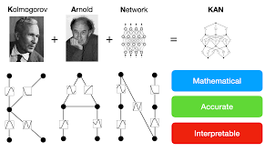

# Discovering Inductor Voltage Formulas with KAN : Kolmogorov-Arnold Networks

## Introduction
Welcome to the Discovering Inductor Voltage Formulas with KAN Networks repository! Here, we explore the practical application of Kolmogorov-Arnold Networks (KANs) in electrical engineering, specifically in deriving formulas for induced voltage in RL circuits. KANs offer a powerful approach to uncovering complex relationships within data, making them invaluable tools for engineers seeking insights into circuit behavior.

## Overview
In this project, we utilize KANs to discover formulas for induced voltage in RL circuits. By leveraging the capabilities of KANs, we aim to extract meaningful patterns from circuit data and develop accurate models for predicting inductor voltage under various conditions.

## Getting Started
To get started with this project, follow these steps:
1. Clone this repository to your local machine.
2. Navigate to the notebook `inductor_voltage_formula.ipynb`.
3. Run the notebook using Google Colab or your preferred Python environment.

## Data
The dataset used in this project contains information about voltage, current, and the rate of change of current in RL circuits, along with corresponding induced voltage values. This data serves as the foundation for training our KAN model.

## Paper
For a deeper understanding of the methodology and results, you can read the accompanying paper titled ["KAN Kolmogorov–Arnold Networks Networks"](https://arxiv.org/pdf/2404.19756).

## Code
The code for this tutorials for a deeper understanding of KAN Nets is available in the repository [pykan](https://github.com/KindXiaoming/pykan). Feel free to explore, modify, and experiment with the code to suit your needs.

## Contributing
Contributions to this project are welcome! If you have ideas for improvements or new features, feel free to submit a pull request.

## License
This project is licensed under the MIT License - see the [LICENSE](LICENSE) file for details.

---

By leveraging the power of KAN Networks, we can unlock valuable insights into complex electrical systems, paving the way for advancements in circuit design and optimization. Join us on this journey of discovery and innovation!
